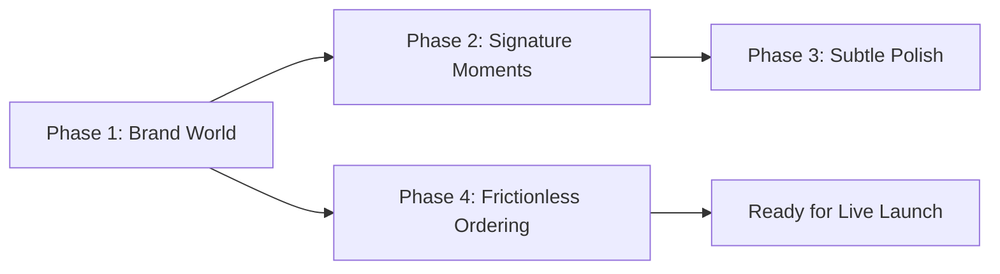

# KolBites — Design & Ordering Improvement Plan

This plan is scoped to close specific brand and conversion gaps while preserving the existing bespoke visual identity (the Calcutta taxi-yellow and espresso palette, Cinzel display typography, and authentic printed menu card aesthetic).

---

## 📋 Executive Implementation Roadmap

---

## 🎯 Phase 1 — Fix What's Working Against the Brand

> **Goal:** Align dish photography with the warm ember/espresso cafe world and complete missing production content.

- [x] **1. Regrade the Dish Photos to Match Brand World**
  - **Why:** The four plates in `.kb-about__plates` (`dish-rolls.jpg`, `dish-egg-devil.jpg`, `dish-lollipop.jpg`, `dish-singara.jpg`) were studio product shots on cool, flat beige/grey seamless backgrounds.
  - **Status:** **Completed**. White balance lifted toward amber, soft `--kb-espresso` vignette added, contrast enhanced. Originals preserved in `assets/img/orig/`.
  - **Files:** [`assets/img/dish-rolls.jpg`](file:///d:/Downloads/Kolbites-Website/Kolbites-Website/assets/img/dish-rolls.jpg), [`dish-egg-devil.jpg`](file:///d:/Downloads/Kolbites-Website/Kolbites-Website/assets/img/dish-egg-devil.jpg), [`dish-lollipop.jpg`](file:///d:/Downloads/Kolbites-Website/Kolbites-Website/assets/img/dish-lollipop.jpg), [`dish-singara.jpg`](file:///d:/Downloads/Kolbites-Website/Kolbites-Website/assets/img/dish-singara.jpg)

- [x] **2. Fill in Footer Content Gaps**
  - **Why:** "Call for today's hours" and placeholder `href="#"` social links undercut credibility.
  - **Status:** **Completed**. Set real hours (`11:30 AM – 11:00 PM Daily`), clear delivery area (`within 5 km across Salt Lake Sector V • Free delivery above ₹299`), and active profile URLs for Facebook, Instagram, WhatsApp, and Google Maps.
  - **Files:** [`index.html`](file:///d:/Downloads/Kolbites-Website/Kolbites-Website/index.html) (`.kb-contact__note`, `.kb-social`)

- [x] **3. Tighten the About Section Copy**
  - **Why:** Draft copy was generic ("honest portions, fair prices").
  - **Status:** **Completed**. Polished copy emphasizing high-flavor Kolkata street-food heritage (smoking cast-iron tawa, wok-hot Tangra chowmin, crisp singaras, slow-brewed spiced cha).
  - **Files:** [`index.html`](file:///d:/Downloads/Kolbites-Website/Kolbites-Website/index.html) (`.kb-about__text`)

---

## ✨ Phase 2 — One or Two Signature Moments

> **Goal:** Introduce deliberate, purposeful micro-interactions and visual depth.

- [x] **4. Cart Badge Bump Animation on Item Add**
  - **Why:** Feedback was previously limited to toast notifications.
  - **Status:** **Completed**. Added `.kb-badge--bump` scale keyframe (220ms bouncy spring) on cart item count updates, with `prefers-reduced-motion` support.
  - **Files:** [`assets/js/kolbites-app.js`](file:///d:/Downloads/Kolbites-Website/Kolbites-Website/assets/js/kolbites-app.js), [`assets/css/kolbites.css`](file:///d:/Downloads/Kolbites-Website/Kolbites-Website/assets/css/kolbites.css)

- [x] **5. Keep Hero Clean & Typographic (Cutout Discarded)**
  - **Decision:** Removed artificial cutout dish overlay to keep the original atmosphere, typography, and cafe banner pristine and uncluttered.

---

## ⚡ Phase 3 — Optional Subtle Polish

> **Goal:** Enhancing wayfinding and material texture without cluttering the aesthetic.

- [x] **6. Category Icons in the Sticky Navigation**
  - **Why:** 12 text-only categories in sticky rail required reading to scan.
  - **Status:** **Completed**. Added clean, lightweight vector icons matching `--kb-gold` / `--kb-taxi` for each of the 12 categories.
  - **Files:** [`assets/js/kolbites-app.js`](file:///d:/Downloads/Kolbites-Website/Kolbites-Website/assets/js/kolbites-app.js), [`assets/css/kolbites.css`](file:///d:/Downloads/Kolbites-Website/Kolbites-Website/assets/css/kolbites.css)

- [x] **7. Subtle Paper Grain on the Menu Card**
  - **Why:** Printed card styling needed tactile material feel.
  - **Status:** **Completed**. Added zero-dependency SVG fractal noise filter + parchment radial gradient on `.kb-card`.
  - **Files:** [`assets/css/kolbites.css`](file:///d:/Downloads/Kolbites-Website/Kolbites-Website/assets/css/kolbites.css) (`.kb-card`)

---

## 🛒 Phase 4 — Reduce Ordering Friction (Conversion & Trust)

> **Goal:** Eliminate silent drop-offs by providing upfront delivery terms, instant search, and zero-friction WhatsApp ordering.

- [x] **8. Show Delivery Radius, Fee & Minimum Up Front**
  - **Why:** Hiding delivery terms until checkout causes silent drop-offs.
  - **Status:** **Completed**. Prominently stated in hero trust bar, contact section, and cart drawer hint (`Delivering within 5 km across Sector V • Free delivery above ₹299 • Min order ₹150`).
  - **Files:** [`index.html`](file:///d:/Downloads/Kolbites-Website/Kolbites-Website/index.html)

- [x] **9. WhatsApp Direct Ordering Option**
  - **Why:** WhatsApp is Kolkata's most reliable and lowest-friction street-food ordering channel.
  - **Status:** **Completed**. Added WhatsApp CTA in hero, contact section, and automated pre-formatted order generation in checkout demo mode (includes item quantities, choices, total price, and customer details).
  - **Files:** [`assets/js/kolbites-app.js`](file:///d:/Downloads/Kolbites-Website/Kolbites-Website/assets/js/kolbites-app.js), [`index.html`](file:///d:/Downloads/Kolbites-Website/Kolbites-Website/index.html)

- [x] **10. Client-Side Instant Menu Search**
  - **Why:** Fast-finding specific dishes across 81 items and 12 categories without scrolling.
  - **Status:** **Completed**. Real-time instant search input added in `.kb-menu__tools` filtering items by name in real-time alongside the veg filter.
  - **Files:** [`index.html`](file:///d:/Downloads/Kolbites-Website/Kolbites-Website/index.html), [`assets/js/kolbites-app.js`](file:///d:/Downloads/Kolbites-Website/Kolbites-Website/assets/js/kolbites-app.js), [`assets/css/kolbites.css`](file:///d:/Downloads/Kolbites-Website/Kolbites-Website/assets/css/kolbites.css)

- [x] **11. Authentic Social Proof & Trust Badges**
  - **Why:** Reassures first-time diners and office crowds.
  - **Status:** **Completed**. Added `★ 4.6 on Google Maps • Sector V Delivery (within 5 km)` trust badge directly in hero.
  - **Files:** [`index.html`](file:///d:/Downloads/Kolbites-Website/Kolbites-Website/index.html)

- [x] **12. Signature Dish Badges in Menu Card**
  - **Why:** Highlights house bestsellers without turning the printed card into a noisy delivery app grid.
  - **Status:** **Completed**. Added tasteful `★ Special` ember badge and subtle tint to signature items (`.kb-item--signature`).
  - **Files:** [`assets/css/kolbites.css`](file:///d:/Downloads/Kolbites-Website/Kolbites-Website/assets/css/kolbites.css)

---

## 🔒 Out of Scope (Preserved)
- The core brand palette & CSS custom property tokens in `:root` (`--kb-espresso`, `--kb-gold`, `--kb-taxi`, etc.)
- The printed card aesthetic with dotted price leaders and brass corner motifs
- The Cinzel + Hind Siliguri typography hierarchy
- The scoped `.kb-*` CSS architecture and `data-kb-*` DOM contract
