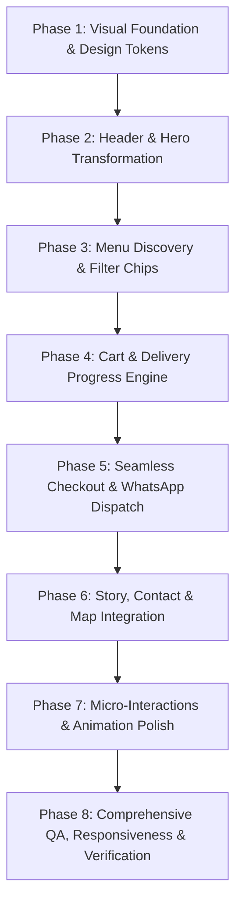

# KolBites — Premium Redesign Strategy & Implementation Plan

> **Product Vision:** Transform KolBites into a **premium, visually impressive, modern restaurant web experience** that celebrates authentic Kolkata street-food culture while providing a frictionless, high-converting digital ordering journey.

---

## A. Current State Audit

### 1. Repository Inventory & Architecture
* **Core Technology:** Built with semantic HTML5, scoped Vanilla CSS (`.kb-*` namespace), and modern Vanilla JavaScript (ES6+ IIFE pattern). Zero external build steps (Webpack/Vite/Babel) or bloated UI frameworks (React/Vue/jQuery/Tailwind).
* **Data Layer:** 
  - `assets/js/kolbites-menu-data.js`: Central in-memory JavaScript data store containing 12 categories and 81 menu items with prices, dietary tags (`veg`, `egg`, `nonveg`), signature flags, and option variants (e.g. Dry vs. Gravy for Chilli Paneer/Chicken).
  - `assets/data/menu.json`: Equivalent JSON schema utilized by server-side verification.
* **Commerce & State Engine:**
  - `assets/js/kolbites-app.js`: In-memory cart state synced to browser `localStorage` (`kolbites_cart_v1`). Handles dynamic item rendering, quantity increment/decrement, options modal, cart drawer display, and order submission.
  - `assets/js/kolbites-pos-adapter.js`: Decoupled gateway layer supporting dual-mode operation:
    1. **Demo Mode (Current):** Compiles order payloads, generates instant WhatsApp messages with formatted items and totals, and provides telephone fallback.
    2. **Live POS Mode:** Dispatches order payload to the WordPress REST API endpoint (`POST /wp-json/kolbites/v1/order`), re-pricing through Pet Pooja POS.
* **Design & Typography Assets:**
  - Self-hosted local WOFF2 web fonts in `assets/fonts/` for **Cinzel** (classical colonial serif display) and **Hind Siliguri** (Bengali/English humanist sans).
  - Brand image assets in `assets/img/` including the circular emblem logo, text-free mirrored cafe banner (`kolbites-banner-clean.jpg`), and regraded warm-tone food plates (`dish-rolls.jpg`, `dish-egg-devil.jpg`, `dish-lollipop.jpg`, `dish-singara.jpg`).
  - Embedded Google Map iframe pinpointing Kolbites' physical location in Sector V, Kolkata.

### 2. What Is Already Working Well
* **Strong Brand Identity Foundations:** The color palette (Ambassador taxi yellow `#F2C230`, Howrah espresso `#2B1712`, Paisley ink `#3A241C`, Terracotta maroon `#6E1B1B`) is culturally authentic and distinctive.
* **Printed Menu Card Concept:** The dotted price leaders, brass corner flourishes, and official Indian dietary markers (Veg green dot, Egg yellow circle, Non-veg red triangle) feel nostalgic and appropriate for a Kolkata kitchen.
* **Zero Technical Debt / Fast Load Time:** No bloated bundles or external network blockers; runs instantaneously on any device.
* **Frictionless Fallback:** Instant WhatsApp preformatted checkout links give immediate utility even without live merchant payment processing.

---

## B. UX & Visual Problems (From the User's Perspective)

| Area | Current Issue | User Impact |
|---|---|---|
| **First Impression / Hero** | Raw periods in tagline (`.....`), no visual distinction between primary/secondary CTAs, lack of active operating indicator. | First-time visitors are confused about whether the restaurant is currently open or what action to take first. |
| **Header Navigation** | "Order Now 98304 55588" is a combined tel link in the header; phone link doesn't open the menu on desktop. | Users clicking "Order Now" on desktop trigger an unwanted telephone protocol prompt instead of jumping to the food menu. |
| **Menu Scanning** | 81 items in a dense 2-column card can feel like reading a phone book. No visual dish highlights or bestseller chips. | Visitors experience cognitive fatigue trying to locate what KolBites is famous for. |
| **Dietary & Category Filtering** | Only "Veg only" toggle exists; cannot filter by "Non-veg", "Egg", or quick categories ("Bestsellers", "Rolls", "Combos"). | Non-veg diners and roll lovers have to scroll through 12 vertical sections to find their favorites. |
| **Search Experience** | Basic browser input; lacks instant clear button, keyboard shortcut hints, or live matching result count feedback (e.g. "Found 6 dishes"). | Unclear if the search worked or if dishes are missing. |
| **Cart Drawer** | Empty cart is bare; active cart does not show progress toward the free delivery threshold. | Missed upsell opportunity to prompt guests to add a ₹20 Kulhad Cha to hit free delivery. |
| **Checkout Experience** | Generic form feel; lacks clear visual step hierarchy (Contact → Delivery Address → Review). | Customers are unsure if checkout will charge them or dispatch to WhatsApp. |
| **Section Transitions** | Colors switch abruptly between dark espresso, cream, maroon, and brown without atmospheric gradient rhythm. | Site feels segmented into disparate blocks rather than a cohesive luxury dining experience. |

---

## C. Design Direction: "Premium Modern Kolkata Restaurant"

The design language will be **"Contemporary Calcutta Culinary"** — fusing the rich intellectual, artistic, and culinary heritage of Kolkata with the sleek, restrained minimalism of modern international hospitality design.

### 1. Visual Tone & Mood
* **Atmospheric Warmth:** Evoking the golden hour of North Kolkata tea cabins, dusk light reflecting on the Hooghly river, and the glow of street-side tawas in Sector V.
* **Editorial Polish:** Clean typography, generous whitespace around headlines, delicate gold hairline borders, and refined subtle shadows instead of harsh outlines.
* **Appetite Appeal:** Elevating the authentic food photography with rich contrast and warm lighting rather than clinical white studio boxes.

### 2. Design System Tokens

```css
:root {
  /* Brand Palette */
  --kb-espresso: #24130E;        /* Deeper, richer page chrome */
  --kb-espresso-card: #2E1913;   /* Elevated dark container */
  --kb-maroon: #6E1B1B;          /* Royal Bengal Terracotta */
  --kb-gold: #C99A3B;            /* Aged brass accents */
  --kb-gold-glow: rgba(201, 154, 59, 0.25);
  --kb-taxi: #F2C230;            /* Classic Ambassador yellow - Primary Action */
  --kb-taxi-hover: #FFD24A;
  --kb-parchment: #F6EFE2;       /* Printed menu card background */
  --kb-paper: #FBF7EE;           /* Warm cream card surfaces */
  --kb-ink: #2E1B14;             /* High-contrast body typography */
  --kb-ink-muted: #6A564F;       /* Secondary details */
  
  /* Status & Dietary */
  --kb-veg: #1B7837;
  --kb-egg: #B7791F;
  --kb-nonveg: #8B2A1C;
  --kb-live: #25D366;            /* Kitchen Open indicator */

  /* Typography Scale */
  --kb-font-display: "Cinzel", Georgia, serif;
  --kb-font-text: "Hind Siliguri", "Segoe UI", sans-serif;
  
  /* Depth & Radii */
  --kb-radius-xs: 4px;
  --kb-radius-sm: 8px;
  --kb-radius-md: 14px;
  --kb-radius-pill: 999px;
  --kb-shadow-subtle: 0 4px 16px rgba(0, 0, 0, 0.12);
  --kb-shadow-card: 0 16px 40px -12px rgba(36, 19, 14, 0.35);
  --kb-shadow-float: 0 20px 48px -10px rgba(0, 0, 0, 0.65);
}
```

---

## D. Benchmark Inspiration Research

We analyzed leading international and Indian hospitality design benchmarks to extract proven UX patterns:

### 1. Dishoom (London / UK)
* **What We Learned:** The benchmark for narrative-driven heritage dining. Dishoom succeeds because its nostalgia never gets in the way of utility.
* **Key Patterns Adopted:** 
  - Restrained, evocative typography paired with instant visual feedback.
  - Seamless dual-mode discovery (browsable menu card + high-intent digital ordering).
  - Clear branch operational transparency (live kitchen opening times and delivery radius shown before order start).

### 2. The Bombay Canteen (Mumbai)
* **What We Learned:** Masterclass in modernizing regional comfort food.
* **Key Patterns Adopted:**
  - Modular category grouping ("Chhotas", "Rolls", "Combos") that guides diners by hunger level.
  - Prominent dietary filtering tabs (Veg / Non-veg / Bestsellers) directly at thumb reach.
  - Clear indication of chef signatures with subtle badge styling rather than disruptive graphics.

### 3. Sienna Store & Café (Kolkata)
* **What We Learned:** Kolkata's own design pioneer celebrating handcrafted terracotta, unbleached paper, brass, and local ingredients with Scandinavian editorial restraint.
* **Key Patterns Adopted:**
  - Tactile paper grain and brass hairline borders that feel artisanal rather than digital.
  - Storytelling rooted in local Kolkata textures (Howrah bridge steel, street tea stalls, earthen bhar).

### 4. Hoppers (London)
* **What We Learned:** High-volume street-food restaurant with exceptionally high mobile conversion rates.
* **Key Patterns Adopted:**
  - Fixed mobile bottom-bar with real-time cart total and checkout progress.
  - Direct WhatsApp channel as a trusted, instant customer support and order line.
  - Transparent fees and minimum thresholds presented before the guest enters the cart.

---

## E. Proposed Page Structure & UX Transformation

```text
[ Sticky Top Header with Blur, Live Status & Quick Cart Trigger ]
                             ↓
[ Cinematic Hero: Refined Typography, Trust Badges, Clear Primary CTA ]
                             ↓
[ Quick Highlights Bar: Bestseller Chips & Dietary Filter Toggles ]
                             ↓
[ Interactive Menu Experience: Sticky Rail + Search + Printed Card Grid ]
                             ↓
[ The Story & Culinary Heritage: Editorial Layout & Warm Dish Plates ]
                             ↓
[ Visit, Contact & Interactive Google Map with Brass Accent ]
                             ↓
[ Cohesive Multi-Column Footer with Operational Hours & Social Links ]
                             ↓
[ Slide-Over Cart Drawer with Free Delivery Threshold Progress ]
                             ↓
[ Clean Modal Checkout with WhatsApp Instant Order Dispatch ]
```

### Section-by-Section Experience Comparison

| Section | Current Experience | Proposed Experience | User Benefit |
|---|---|---|---|
| **Header** | Logo, basic text nav, combined phone button with raw numbers. | Blurred glassmorphic header, active page indicator, distinct "Order Now" button + standalone telephone icon, animated cart badge. | Frictionless navigation; desktop users can start ordering without phone dialing prompts. |
| **Hero Section** | Plain headline with raw dots (`.....`), three conflicting buttons, static address. | Clean editorial headline ("A Dash of Kolkata — in Every Bite!"), live "🟢 Kitchen Open" pill, high-contrast primary "Explore Menu" CTA, Google Maps 4.6★ rating. | Immediate appetite stimulation, clear brand trust, unambiguous single primary path forward. |
| **Quick Discovery** | Only a "Veg only" toggle hidden inside the menu heading. | Horizontal pill bar: [ ★ Bestsellers ] [ All Dishes ] [ Kathi Rolls ] [ Chowmin ] [ Combos ] + [ 🟢 Veg ] [ 🔴 Non-Veg ]. | Cuts search time in half for diners with specific dietary needs or cravings. |
| **Menu Experience** | Dense 2-column text list; basic search input; simple item lines. | Refined printed-card layout with subtle paper grain, live search with result count feedback ("Showing 8 dishes"), signature highlight tags, smooth stepper controls. | Retains the authentic nostalgic printed card feel while elevating readability and interactive speed. |
| **Brand Story (About)** | Text on left, 4 square/wide photos on right in a plain grid. | Editorial magazine-style spread: warm amber-graded dishes with subtle hover depth, storytelling celebrating Tangra woks and tawa-hot rolls. | Transforms casual viewers into loyal brand advocates who understand KolBites' authenticity. |
| **Visit & Map** | Embedded Google Map with standard border below contact columns. | Integrated Visit & Order card with live operational hours, 1-click WhatsApp inquiry, and Google Maps iframe in an elegant brass-bordered frame. | Effortless physical wayfinding and immediate confirmation of delivery coverage. |
| **Cart Drawer** | Simple slide-out drawer; plain text delivery note. | Polished drawer with dynamic Free Delivery Progress Bar (*"Add ₹49 for Free Delivery!"*), clear stepper counters, line-item pricing, and empty-state recommendations. | Transparent pricing eliminates unexpected fees; boosts average order value (AOV). |
| **Checkout Flow** | Standard form modal with basic browser inputs. | Visual pickup vs delivery selector, auto-formatting phone input, clear price breakdown, and one-click WhatsApp order generator with complete receipt summary. | Zero-drop-off ordering tailored for Kolkata's communication culture. |

---

## F. Animation & Micro-Interaction Strategy

> **Core Rule:** Animation must inform, guide, or confirm an action — never distract, slow down, or delay the user. All motion strictly honors `prefers-reduced-motion`.

1. **Page Entrance & Section Reveal:**
   - Smooth `opacity: 0 → 1` with a subtle 12px vertical translate using `cubic-bezier(0.16, 1, 0.3, 1)` over 350ms as elements enter the viewport.
2. **Interactive Stepper & Add Button:**
   - When "Add" is clicked, button morphs smoothly into `- 1 +` stepper with a gentle scale pop (`scale(1.05) → scale(1.0)`).
3. **Cart Badge Bump:**
   - On item addition, the cart count badge executes a quick 220ms spring bounce (`.kb-badge--bump`), confirming the item was saved without needing intrusive popups.
4. **Free Delivery Progress Bar:**
   - Progress fill bar animates width smoothly (`transition: width 0.3s ease`) as cart value approaches ₹299.
5. **Card Hover & Tactile Feedback:**
   - Menu items and action buttons have subtle 1px elevation and color transitions (`transition: all 0.15s ease`).

---

## G. Component Architecture Changes

```text
[REUSED]
├── Assets: Fonts (Cinzel, Hind Siliguri WOFF2)
├── Data: kolbites-menu-data.js (All 81 items, 12 categories, options)
├── POS Bridge: kolbites-pos-adapter.js (Order payload builder & API contract)
└── WordPress: functions-snippet.php & kolbites-petpooja-proxy.php

[MODIFIED]
├── Header: Separate navigation, order CTA, phone icon, and cart trigger
├── Hero: Refined typography, live status indicator, distinct CTA hierarchy
├── Menu Header: Unified search bar with clear button + quick discovery category pills
├── Menu Card: Enhanced printed-card styling, signature badges, smooth steppers
├── Story (About): Magazine editorial layout with refined typography and image frames
├── Contact & Footer: Integrated Google Maps embed with place card and hours badge
└── Cart & Checkout: Delivery progress bar, item controls, WhatsApp order generator

[CREATED]
├── DeliveryProgressBar: Visual progress indicator toward free delivery (₹299 threshold)
├── QuickFilterChips: Fast-toggle chips for Bestsellers, Kathi Rolls, Chowmin, Combos, Diet
├── LiveSearchResultCounter: Real-time feedback for active search queries
└── KitchenStatusPill: "🟢 Kitchen Open • 11:30 AM – 11:00 PM" live status badge
```

---

## H. Responsive & Mobile-First Strategy

Over 70% of restaurant orders occur on mobile devices. The redesign treats mobile as a first-class citizen:

* **Mobile Thumb-Zone Navigation:**
  - Sticky bottom cart bar displaying item count, subtotal, and one-tap checkout button (`height: 52px` with safe-area-inset padding).
  - Horizontal swipeable category rail (`.kb-catnav__list`) with hidden scrollbars and smooth snapping, allowing thumb-sliding between *Cha, Rolls, Chowmin, Combos*.
* **Touch Targets & Ergonomics:**
  - All interactive buttons and stepper controls have a minimum touch target of `44x44px`.
  - Form fields use `font-size: 16px` on iOS/Android to prevent automatic browser zoom on focus.
* **Modal Sheets on Mobile:**
  - The cart drawer and checkout modal take 100% viewport width on mobile screens with easy-to-tap close buttons and tactile backdrops.

---

## I. Performance & Maintainability Strategy

* **Zero Additional Dependencies:** No React, Vue, jQuery, or animation libraries added. 100% pure native browser capabilities.
* **Efficient Asset Delivery:**
  - All fonts are pre-downloaded local `.woff2` files with `font-display: swap`.
  - Below-the-fold dish images and Google Map iframe load asynchronously using `loading="lazy"`.
* **Zero Layout Shift (CLS):** Explicit `width` and `height` attributes on all images and embeds to prevent content jumping.
* **Maintainable Scoped Code:** All styles prefixed with `.kb-*` and behaviors bound via `data-kb-*` attributes, guaranteeing complete compatibility with WordPress child themes or Elementor/Gutenberg blocks.

---

## J. Accessibility Strategy (WCAG 2.1 AA Compliance)

* **Semantic HTML Structure:** Single `<h1>`, logical `<h2>` and `<h3>` headings, landmark roles (`<header>`, `<nav>`, `<main>`, `<section>`, `<aside>`, `<footer>`).
* **Visual Focus & Keyboard Nav:** High-contrast focus rings (`:focus-visible`) styled in `--kb-taxi` / `--kb-gold`.
* **Screen Reader Transparency:** Native `<dialog>` elements with `aria-modal="true"`, `aria-labelledby`, and `aria-live="polite"` announcements for cart total updates.
* **Color Contrast:** All text meets or exceeds the 4.5:1 contrast ratio against respective backgrounds.

---

## K. Implementation Roadmap & Phases



* **Phase 1 — Visual Foundation:** Refine CSS design tokens, typography scale, surface colors, and atmospheric gradients in `kolbites.css`.
* **Phase 2 — Header & Hero:** Elevate navigation hierarchy, live kitchen status pill, refined typography, and clear primary CTA.
* **Phase 3 — Menu Discovery:** Implement quick filter chips (Bestsellers, Rolls, Chowmin, Diet) and real-time search with result counter.
* **Phase 4 — Cart Engine:** Add free delivery progress bar, smooth steppers, and clear pricing breakdown.
* **Phase 5 — Checkout Flow:** Refine checkout dialog with visual pickup/delivery switcher and WhatsApp order dispatch.
* **Phase 6 — Story & Contact:** Polish editorial About layout, operating hours card, and Google Maps embed.
* **Phase 7 — Animations & Motion:** Add subtle scroll reveals, button press states, badge bumps, and reduced-motion fallbacks.
* **Phase 8 — Multi-Device QA:** Verify on desktop, tablet, and mobile viewports; validate 0 console errors and clean keyboard navigation.

---

## L. Acceptance Criteria

1. **Brand Aesthetic:** Website feels like an authentic, premium Kolkata restaurant — warm, nostalgic, polished, and confident.
2. **Content Preservation:** 100% of the 81 menu items, 12 categories, prices, options, contact numbers, and address are intact and functional.
3. **Ordering Journey:** A user can land on the site, filter dishes, customize options, add to cart, review with free delivery clarity, and complete checkout via WhatsApp or phone call in under 60 seconds.
4. **Responsiveness:** Flawless visual presentation and interaction across mobile (375px–420px), tablet (768px–1024px), and desktop (1280px+).
5. **Technical Health:** 0 console errors, fast initial load (<1 second), valid HTML/CSS/JS, and full accessibility compliance.
